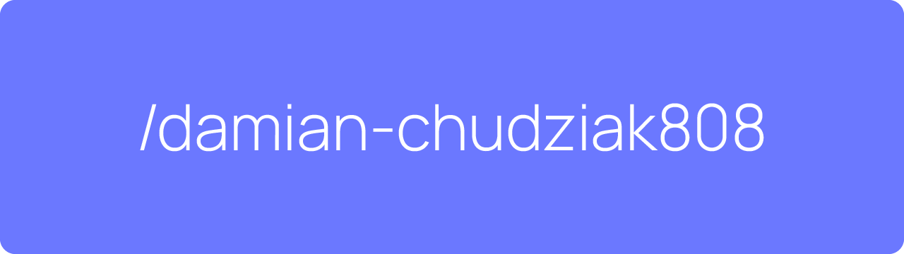

</img>

## About me
I'm a 20 years old student who is trying to learn all he can about programming, and land a job as a frontend developer.  
Right now I'm expanding my knowledge about the proper use of React framework.

## What I'm currently working on
I am currently working on my first major project which I have called - [**DASHPASH**](https://github.com/damian-chudziak808/dashpash) 

It is a simple superset of tools centered around Morse code.
The app allows you to translate messages into Morse code and vice versa, learn Morse code, save and read your messages and their translations, and more.
It's still under development, so a lot of things aren't done yet.

## Technologies I know and use

    </img>

___
<h3 align="center">Contact me</h3>

    <a href="mailto:damian.chudziak808@gmail.com">
    </img>
</a>
<a href="https://discord.com/users/750971983226863666">
    </img>
</a>
<a href="https://www.linkedin.com/in/damian-chudziak-501287248/">
    </img>
</a>

